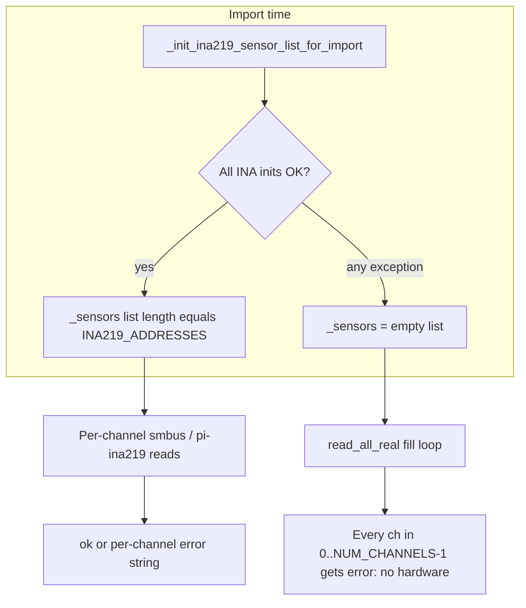

# Code review: channel assignment and “no hardware” / ref-vs-anode behavior

This page documents how the firmware maps **anode channels** to I²C, the TCA9548A mux, and the reference (ADS1115) path, and which code can produce `error: "no hardware"` or `READ ERROR` lines. It complements the bring-up checklist in [ina219-i2c-bringup.md](ina219-i2c-bringup.md).

## 1. What “channel” means in firmware

Every user-facing “Anode N” maps to a **0-based index** `ch` with **`N = ch + 1`**. The same index is used consistently for:

| Concern | Config / code |
|--------|----------------|
| Shunt / bus sense | [`INA219_ADDRESSES[ch]`](../config/settings.py) — list order is the only binding to “which INA is anode 1..4” |
| TCA port before that INA | [`I2C_MUX_CHANNELS_INA219[ch]`](../config/settings.py) (only when `I2C_MUX_ADDRESS` is set; `None` = all INA on the same bus, no mux) |
| PWM MOSFET | [`PWM_GPIO_PINS[ch]`](../config/settings.py) |
| Labels in faults / logs | [`channel_labels.py`](../src/channel_labels.py) `anode_hw_label(ch)` combines GPIO + INA addr + optional TCA port |

**Foot-gun:** If the **physical** harness order does not match **list order** in `INA219_ADDRESSES` / `I2C_MUX_CHANNELS_INA219`, you get wrong current on the wrong row—not “no hardware,” but wrong channel mapping. There is no runtime auto-discovery; mapping is **declarative in config only**.

## 2. Root cause of identical `error: "no hardware"` on all anodes

- **Source:** [`sensors.py`](../src/sensors.py) — import block (`_sensors` init) and `read_all_real` “Fill missing channels” loop.
- If **`_sensors` is empty** (init failed on **any** single address after mux select), the `for iccp_ch, sensor in enumerate(_sensors):` body **never runs**, so **`results` has no keys**, and the fill loop assigns **`"error": "no hardware"`** for **every** `ch` in `range(cfg.NUM_CHANNELS)`.
- **Partial init does not exist:** one failed INA `configure()` clears the whole list; you do not get “3 good + 1 bad” at import time.

**Independent of that:** the **reference** path is a **separate** module and bus client.

## 3. Reference (ADS1115) vs anode (INA219) — separate code, shared bus

- **Anodes:** [`sensors.py`](../src/sensors.py) — `pi-ina219` `INA219` objects, mux via `I2C_MUX_CHANNELS_INA219` + `I2C_MUX_ADDRESS` in `_init_ina219_sensor_list_for_import` and `_remux_ina219_channel` in `read_all_real`.
- **Reference:** [`reference.py`](../src/reference.py) — `REF_ADC_BACKEND` default **`ads1115`**, opens `smbus2` in `_init_ref_ads1115`, selects **`I2C_MUX_CHANNEL_ADS1115`** (default **4**) before talking to `ADS1115_ADDRESS` (default **0x48**). Routine reads use `mux_select_on_bus` + `i2c_bus_lock` in [`i2c_bench.py`](../src/i2c_bench.py) in the ADS read path.

So **“ref works, all anodes no hardware”** is **logically consistent** in code: ADS init can succeed (ch4 + 0x48) while INA import fails (ch0–3, addresses, power, or mux path to those ports). It is **not** proof of a single shared “I2C works / fails” boolean.

**Reference input pin:** [`ADS1115_CHANNEL`](../config/settings.py) (default **0** = AIN0). `iccp probe` prints AIN0..AIN3; if wiring is on AIN1+ but `ADS1115_CHANNEL=0`, the **value** is wrong, not `no hardware`.

## 4. Import order (can affect mux state / side effects, not the empty `_sensors` condition)

- **`iccp start`** ([`main.py`](../src/main.py)): `import sensors` **before** `iccp_runtime` — **INA import init runs first**, then `run_iccp_forever` imports `commissioning`, which imports `reference` ([`commissioning.py`](../src/commissioning.py) line 20) — **reference/ADS second** (if not already loaded).
- **`iccp commission`** ([`iccp_cli.py`](../src/iccp_cli.py) `_cmd_commission`): `import commissioning` **first** → **reference loads immediately** (commissioning’s top-level import) → **ADS init first**, then `import sensors` → **INA second**.

`iccp probe` ([`hw_probe.py`](../src/hw_probe.py)) is **not** the same process order as either CLI path; it uses **smbus2 only** and does not construct `sensors._sensors`. A green probe + failing app usually means **pi-ina219 / import-time init** or **env** (e.g. sim), not “scan wrong.”

## 5. Runtime behavior after successful init (not `no hardware`, but related “READ ERROR”)

- `read_all_real` holds `i2c_bus_lock` and **re-selects the mux per anode** before each INA read; one **OSError** (e.g. errno 5) on a channel becomes that channel’s `error` string, not `"no hardware"` (unless the whole enumerate was skipped).
- There is a **double retry** on errno 5 for INA with short sleep + re-mux.
- [`control.py`](../src/control.py) emits **`READ ERROR: ...`** from `r.get("error")` for non-ok reads (and `ina219_read_failure_expected_idle` in `sensors.py` can suppress some idle noise).
- **Bus-level fail-safe:** `_bus_level_read_failure` in `control.py` + `INA219_FAILSAFE_ALL_OFF` / `INA219_FAILSAFE_MIN_BUS_CHANNELS` in settings — **many channels** with EIO-style errors can force **all** outputs off; that is separate from the `"no hardware"` string.

## 6. Config knobs that must stay internally consistent

- **`NUM_CHANNELS`**: loops in control, TUI, logger assume `0..NUM_CHANNELS-1`. If ever **`len(INA219_ADDRESSES) < NUM_CHANNELS`**, init would still only create `len(INA219_ADDRESSES)` objects; `ina219_sensors_ready()` in `sensors.py` uses **equality** of `len(_sensors)` to `len(INA219_ADDRESSES)` — a deliberate mismatch in settings could mark “not ready” and still leave fill behavior dependent on the enumerate (worth avoiding).
- **No mux vs mux:** if `I2C_MUX_ADDRESS` is `None`, code paths skip mux selection; a **board that still has a TCA** may see wrong or invisible devices.
- **Legacy** `I2C_MUX_CHANNEL_INA219` (single port) vs **`I2C_MUX_CHANNELS_INA219`** (per index): `read_all_real` and `_mux_select_ina219_bus` use different branches — wrong combination in settings can leave the mux on the wrong port.
- **Pi + `COILSHIELD_SIM`:** `main.py` **forces hardware** on a Pi if `--sim` was not passed, even when the environment says sim — good to know when comparing to a **non-cli** `python` REPL that imported `sensors` with `SIM=1`.

## 7. Files: debug surface for this behavior

| Area | Files |
|------|--------|
| INA init + `no hardware` fill + read path | [`sensors.py`](../src/sensors.py) |
| Mux primitive + lock + post-delay | [`i2c_bench.py`](../src/i2c_bench.py) |
| Reference ADS + mux + scale | [`reference.py`](../src/reference.py), [`config/settings.py`](../config/settings.py) `ADS1115_*`, `REF_ADS_*` |
| Channel labels for logs | [`channel_labels.py`](../src/channel_labels.py) |
| Faults / READ ERROR | [`control.py`](../src/control.py) |
| Startup messaging | [`iccp_runtime.py`](../src/iccp_runtime.py) |
| Bench scan (smbus2, not `sensors`) | [`hw_probe.py`](../src/hw_probe.py) |
| Import order for commission | [`iccp_cli.py`](../src/iccp_cli.py), [`commissioning.py`](../src/commissioning.py) |

## 8. Operational checks

When `iccp start` still shows `no hardware` but `iccp probe` is green: confirm **the same** `config.settings` is loaded (no duplicate checkout, venv, or systemd `WorkingDirectory`), and read **`[sensors] Hardware init failed: ...`** and **`[sensors] INA219 initialized on N channels`** at process start—those two lines are authoritative for import-time path vs. runtime read path.
