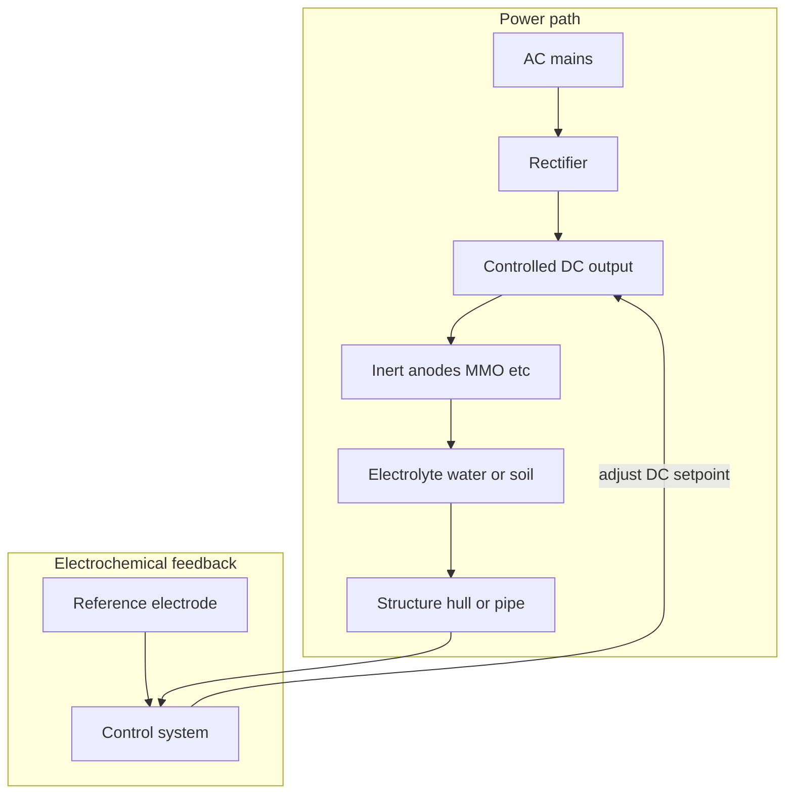
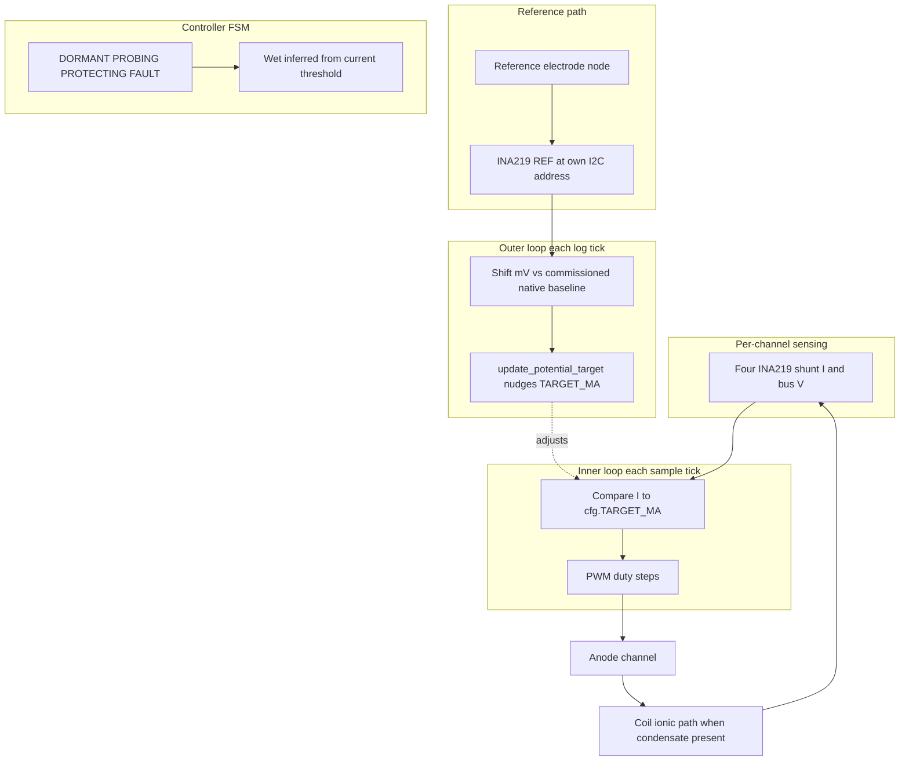
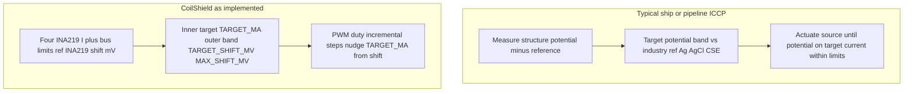

# ICCP: industry practice vs CoilShield (informational)

This document compares **classical impressed-current cathodic protection (ICCP)** as used on ships and buried pipelines with **what this repository implements** (CoilShield HVAC coil hardware + Raspberry Pi firmware). It is for engineering context, not a product compliance claim.

**Hardware note:** CoilShield uses a **Raspberry Pi**, **five [INA219](https://www.ti.com/product/INA219)** boards on one I2C bus — **four** for anode channel current/bus (`sensors.py`) and **one** dedicated to the **reference electrode** (`reference.py`, `REF_INA219_ADDRESS`) — plus **PWM-driven MOSFETs** per anode channel. Long-form datasheet material: [knowledge-base/README.md](knowledge-base/README.md). Anode **soft-PWM defaults to 100 Hz** (`PWM_FREQUENCY_HZ` in `config/settings.py`): that favors **quieter coupling** into reference/ADS and I2C vs **~1 kHz**; **≥20 kHz** is an alternative when you want switching **above** audio/ADC bands—see the comment block on that setting for ripple vs EMI tradeoffs.

For a line-by-line mapping of common ICCP claims to code paths, see [iccp-vs-coilshield.md](iccp-vs-coilshield.md).

---

## Firmware logic map (quick reference)

| Area | Role | Primary files |
|------|------|----------------|
| Main loop | Sensor read → control tick → reference shift → periodic outer loop / logging | [`main.py`](../main.py) |
| Inner ICCP control | FSM (`DORMANT` / `PROBING` / `PROTECTING` / `FAULT`), incremental PWM vs `TARGET_MA`, faults | [`control.py`](../control.py) |
| Anode sensing | Per-channel shunt current + bus V (INA219) | [`sensors.py`](../sensors.py), [`config/settings.py`](../config/settings.py) `INA219_*` |
| Reference sensing | Dedicated INA219 → mV-like scalar; `native_mv`, `shift_mv`, `protection_status` | [`reference.py`](../reference.py), `REF_INA219_*` in settings |
| Commissioning | Native baseline, ramp until shift ≥ `TARGET_SHIFT_MV`, write `commissioning.json` | [`commissioning.py`](../commissioning.py) |
| Telemetry | SQLite / CSV / `latest.json`; electrical proxies for impedance / cell V | [`logger.py`](../logger.py) |

---

## Industry criteria (SP0169-style summary)

Typical buried/submerged pipeline CP standards (AMPP / NACE **SP0169** family) emphasize **structure potential** vs a **fixed reference electrode** (e.g. Cu/CuSO₄, Ag/AgCl), with criteria such as **−850 mV CSE** (instant-off or on-potential with IR considerations), **100 mV polarization shift**, and limits to avoid **overprotection**. **Current** from the rectifier is whatever is needed to meet that criterion, bounded by equipment design — not usually a fixed mA setpoint in the fast loop.

**CoilShield** instead runs a **current inner loop** when wet, with a **slow outer loop** that nudges `TARGET_MA` from **reference shift vs a commissioned native baseline**. That is **analogous** to caring about polarization, but it is **not** the same as criterion-grade potential control or survey practice in SP0169/TM0497.

---

## External standards and further reading

Authoritative industry anchors (paid standards; listings on AMPP):

1. **AMPP — Cathodic protection (overview, courses, standard links):**  
   [https://www.ampp.org/standards/ampp-standards/cathodic-protection-industry](https://www.ampp.org/standards/ampp-standards/cathodic-protection-industry)

2. **Control of external corrosion on underground or submerged metallic piping systems** (NACE SP0169 lineage):  
   [https://content.ampp.org/standards/book/1073/Control-of-External-Corrosion-on-Underground-or](https://content.ampp.org/standards/book/1073/Control-of-External-Corrosion-on-Underground-or)

3. **Measurement techniques related to criteria for cathodic protection** (NACE TM0497 lineage):  
   [https://content.ampp.org/standards/book/979/Measurement-Techniques-Related-to-Criteria-for](https://content.ampp.org/standards/book/979/Measurement-Techniques-Related-to-Criteria-for)

4. **Offshore pipeline CP** — ISO **15589-2** (catalogue):  
   [https://www.iso.org](https://www.iso.org) — search for the current edition of 15589-2.

5. **INA219** (device used for anode and reference channels):
   [https://www.ti.com/product/INA219](https://www.ti.com/product/INA219) · [datasheet](https://www.ti.com/lit/ds/symlink/ina219.pdf) · CoilShield notes: [ina219-datasheet-notes.md](ina219-datasheet-notes.md)

---

## Typical industry ICCP (potential-controlled)

High-level architecture:

**Typical control idea**

- **Primary setpoint:** structure **potential** versus a **reference electrode** (e.g. Ag/AgCl in seawater, Cu/CuSO₄ in soil), held in a protection band.
- **Current:** whatever the supply must deliver (within limits) to **hold that potential** as salinity, temperature, coating, and area exposure change.

---

## This repository: CoilShield (inner current loop + optional reference outer loop)

Data and control path as implemented today:

**Inner loop (primary when protecting)**

- **`TARGET_MA`** (`config/settings.py`) is the current setpoint; `Controller.update` in `control.py` steps PWM duty so shunt **current** tracks it when the channel is **PROTECTING**.
- Wet/dry is still inferred from **conduction** (current vs `CHANNEL_WET_THRESHOLD_MA`), not from the reference reading alone.

**Reference path (polarization shift, not “absolute CSE criterion”)**

- `reference.py` reads the reference node via the **dedicated INA219** (default: bus voltage × 1000 as the mV-like scalar; configurable `REF_INA219_SOURCE`) and compares to a **native baseline** captured during **commissioning** (`commissioning.py`, `commissioning.json`). **Shift (mV)** reflects change vs that baseline.
- `Controller.update_potential_target(shift_mv)` is an **outer loop**: if shift is below `0.8 * TARGET_SHIFT_MV`, it raises `TARGET_MA` (capped); if above `MAX_SHIFT_MV`, it lowers `TARGET_MA`. That is **electrochemical feedback on a slow variable** (target current), not direct servo of structure potential to an industry criterion voltage.

**Commissioning**

- On first run (no `commissioning.json`), commissioning averages the reference with channels off → **`native_mv`** using **`COMMISSIONING_NATIVE_SAMPLE_COUNT`** samples at **`COMMISSIONING_NATIVE_SAMPLE_INTERVAL_S`** spacing, then ramps by **`COMMISSIONING_RAMP_STEP_MA`**: after each **`COMMISSIONING_RAMP_SETTLE_S`** regulate segment, PWM duties are saved, outputs go to **0%** (simultaneous or **`COMMISSIONING_OC_SEQUENTIAL_CHANNELS`** per channel), an **INA219 off-confirm** step gates the following ADC read, then **`COMMISSIONING_OC_CURVE_ENABLED`** drives a **short ADS1115 burst** (or a **`COMMISSIONING_OC_DURATION_MODE`** time window with **`COMMISSIONING_OC_CURVE_DURATION_S`** / **`COMMISSIONING_OC_CURVE_POLL_S`**) at high data rate and **`find_oc_inflection_mv`** picks the OC scalar (legacy mode: **`COMMISSIONING_INSTANT_OFF_S`** dwell + single read). Duties return via **`set_duty`** only, then one control tick; **shift** = `reading − native_mv` (OCP / instant-off reading minus baseline); when shift ≥ **`TARGET_SHIFT_MV`** for five consecutive steps, **`commissioned_target_ma`** is stored for `TARGET_MA` on subsequent starts (`main.py`). **`REF_ADS_MEDIAN_SAMPLES`** denoises routine reference reads; **`ADS1115_ALRT_GPIO`** (e.g. **24**) can synchronize conversion-ready on hardware; optional **`COMMISSIONING_PWM_HZ`** trades PWM frequency during Phase 1 / instant-off commissioning vs **`PWM_FREQUENCY_HZ`** for noise coupling.

---

## Side-by-side: industry vs CoilShield

| Topic | Industry ICCP (summary) | This repo |
|--------|-------------------------|-----------|
| Primary setpoint | Structure **potential** vs reference (protection criterion) | **Current** `TARGET_MA` in the inner loop; outer loop only **nudges** that target from **reference shift** vs commissioned baseline |
| Main fast feedback | Reference electrode + structure potential | Shunt **current** (+ bus V windows) via **INA219** on each anode channel |
| Reference role | Defines the control error directly | **Commissioning** sets baseline and per-unit **commissioned_target_ma**; in run, **shift window** trims aggressiveness—not the same as holding −0.85 V CSE |
| Current | Mostly a **consequence** (capped for safety) | **Regulated** in the inner loop; `MAX_MA` and bus limits **latch faults** |

**Verdict:** The firmware is still best described as **current-in-the-loop** cathodic biasing with **environmental gating** (wet film) and **optional reference-based outer trimming**. That is **closer** to classical ICCP than a pure shunt-only design, but it is **not** equivalent to standards-style **potential-controlled ICCP** against a portable reference in bulk electrolyte. Closing that gap would mean explicit **structure potential** measurement vs an industry reference, documented criterion bands, and a control law where **current is primarily a limit**—beyond what the INA219 reference channel alone provides.

---

## If you ever want “classical ICCP-like” behavior

Conceptual upgrade path (beyond the current stack):

1. Measure **structure (or coupon) potential vs an industry reference** in the same environment as the protection criterion.
2. **Outer loop:** adjust drive until potential meets the criterion band.
3. Keep **current limits** (`MAX_MA`, bus limits, fault latch) as **hard ceilings**.

The existing reference + shift loop is a useful **directional** step; full alignment is still new sensing, placement, and control design.

---

## Related reading in this repo

- Repo mapping table and nuances: [iccp-vs-coilshield.md](iccp-vs-coilshield.md).
- Bench **series resistor** vs active control: [README.md](../README.md).
- Telemetry / dashboard: [README.md](../README.md).
