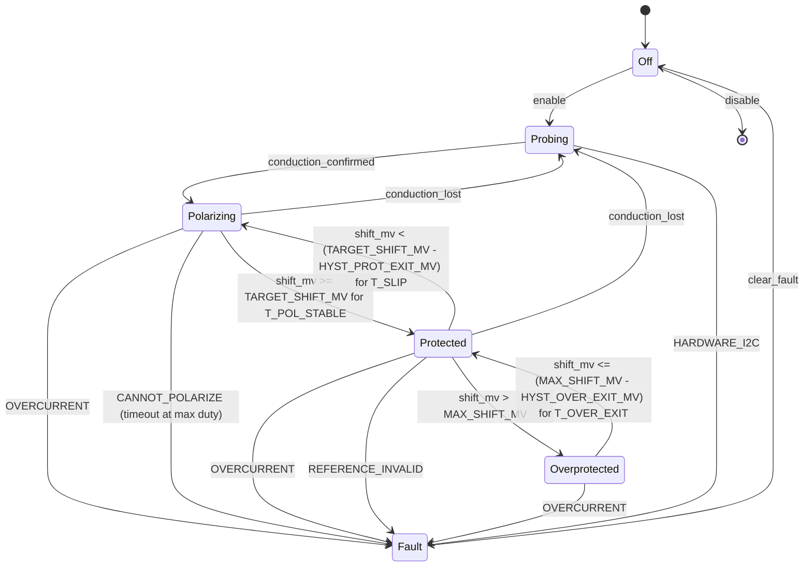

# ICCP requirements (v1)

**Status:** Draft for review. No code change depends on this document yet.
**Scope:** Behavior the controller must guarantee. Implementation is out of scope — a separate architecture / rewrite plan will be written *against* this doc once accepted.

All "Today" call-outs are verbatim descriptions of current code, cited by file and line, so the delta between "what we have" and "what we need" is explicit. If a current-behavior note is wrong, fix it here first, then fix the code later.

**Code map (Tier 1 vs Tier 2 timing):** [supervisor-architecture.md](supervisor-architecture.md) — the slow “headquarters” loop lives in `iccp_runtime.py` + `Controller.update_potential_target`, not a separate `supervisor.py`.

---

## 1. Purpose and north star

The controller's job is to **maintain at least 100 mV of cathodic polarization (industry DVM: reference on +, structure on −) on every protected channel, relative to that channel's native (de-energized) open-circuit reading**, within an operator-set tolerance band and without exceeding per-channel current and voltage safety limits. Software reports **`shift_mv = ref_reading_mV − native_baseline_mV`**, so **positive** shift means the same thing as a **higher** hand-meter reading under CP vs native.

Every other requirement in this document — current regulation, PWM duty, per-channel state machine, commissioning procedure, telemetry — is in service of measuring and sustaining that shift.

This is the [NACE/AMPP SP0169 "100 mV polarization" criterion](https://ampp.org), **not** the `-0.85 V vs CSE` absolute-potential criterion. Justification: the coil-and-pan geometry cannot reliably present a true CSE reference, but it can present a stable Ag/AgCl pseudo-reference whose **shift relative to its own native** is meaningful.

### Not goals (explicit)

- Not certifying pipelines or any regulated structure. This is HVAC coil protection.
- Not replacing handheld field measurements with a "lab-grade" potential readout. The reference is a pseudo-reference; its *shift* is the contract, not its absolute mV.
- Not a generic CP platform. The doc is written against the existing 4-channel coil/pan rig.

---

## 2. Success criteria (measurable)

The controller is "doing its job" when all of the following hold, observable from `logs/latest.json` and SQLite trends, without opening a debugger or reading the code.

### 2.1 Per-channel criterion

For each enabled channel `c`:

- `shift_mv = ref_mv[c] - native_mv >= TARGET_SHIFT_MV` (default `100` mV; `native_mv` is a single shared scalar — see §3.1; **instant-off** `ref_mv` vs OCP baseline), and
- That condition holds for at least `T_POL_STABLE` seconds continuously (new parameter; default `300` s = 5 min **[interim — revisit after first bench soak]**), and
- `shunt_i_ma[c] <= CHANNEL_MAX_I_MA[c]` at all times, and
- `shift_mv[c] <= MAX_SHIFT_MV` at all times (overprotection ceiling; default `200` mV **[interim — revisit after first bench soak]** — see [config/settings.py](../config/settings.py) `MAX_SHIFT_MV`).

Only when all four hold does the per-channel state become `Protected` (see Section 4).

### 2.2 System-level criterion

- All **participating** enabled channels (not still `Off` on a dry/un-driven path) are simultaneously `Protected` for `T_SYSTEM_STABLE` seconds (proposed default `60` s) before the system reports `all_protected = true` in `latest.json`. An enabled channel remaining `Off` does not block the assertion. An enabled channel in `Fault` blocks it until cleared.
- The system is "protecting" when `all_protected = true`. `wet_channels > 0` is **not** the same thing and is demoted to an informational count (see Section 4).

### 2.3 Hard ceilings (always)

- `CHANNEL_MAX_I_MA` per channel (current [MAX_MA](../config/settings.py), per-channel override [CHANNEL_MAX_MA](../config/settings.py)).
- `MAX_SHIFT_MV` (over-protection).
- `STACK_MAX_V` (bus), current [MAX_BUS_V](../config/settings.py); and a `STACK_MIN_V` floor ([MIN_BUS_V](../config/settings.py)).
- Loss of reference, loss of I²C on the anode bank, or an unhandled exception ⇒ all gates LOW until fault is cleared (see Section 6).

### 2.4 Observability (auditable live)

`latest.json` must expose, at minimum, the fields listed in Section 9, written every control tick. Anyone — dashboard, TUI, field tech, SQLite query — must be able to answer "is this rig at `>=100 mV` shift on every channel?" without reading source.

---

## 3. Reference frame and native baseline

> **This is the first of two areas today's controller gets wrong in practice.**

### 3.1 Definition

`native_mv` is the measured reference potential at the pan/coil sense point (volts at the ADS1115 AIN node × scale, per [reference.py](../reference.py) `ReferenceElectrode.read()`) when **all anodes have been fully de-energized long enough for the cell to relax to its free-corrosion potential**.

`native_mv` is a **single shared scalar**, not a per-channel array (decision Q1 in the Decisions log). The rig has exactly one reference electrode, and the shift math uses `instant-off` to remove channel-specific IR artifact before the sample is taken — there is no channel-specific "native" the sensor can distinguish. Every channel's `shift_mv` derives from the same `native_mv`. The `state_v2` FSM is still **per channel** in software (supervision, timers, and `latest.json`), but that is an **operational proxy**: local overpotential and wetting can differ by anode while shift is one shared measurement from the reference.

### 3.2 Preconditions for a valid native capture

All of these must hold for the full capture window, not just at the start:

1. **All anode gates at hard LOW**, not soft-PWM 0%. Hardware-equivalent of `controller.enter_static_gate_off()` (see [control.py](../control.py) `PWMBank.enter_static_gate_off`).
2. **Shunt currents confirmed at rest.** Every INA219 reads `|I| < I_REST_MA` (proposed default `0.3` mA; today `COMMISSIONING_OC_CONFIRM_I_MA = 1.0` mA is too loose — see sidebar) for `T_REST_CONFIRM` seconds continuously.
3. **Reference stable.** Rolling std-dev of the reference over a window `W_REF = 10` s below `NATIVE_STABILITY_MV` (proposed default `3` mV) for `T_RELAX` seconds (default `60` s **[interim — revisit after first bench soak]**).
4. **Slope gate.** Linear slope over the capture window ≤ `NATIVE_SLOPE_MV_PER_MIN` (proposed default `2` mV/min). If the reference is still drifting faster than that, the cell has not relaxed.
5. **Temperature recorded.** `pan_temp_f` from the DS18B20 is captured alongside the native so `REF_TEMP_COMP_MV_PER_F` has a valid anchor point (see [reference.py](../reference.py) `ref_temp_adjust_mv`).

### 3.3 Capture procedure

- Collect samples at `NATIVE_SAMPLE_INTERVAL_S` (proposed `1.0` s) for the full `T_RELAX` window.
- Compute `native_mv = median(samples)`. **Median, not mean** (today's code uses mean — see sidebar).
- Reject and retry if any precondition in §3.2 fails during the window.
- Retry policy: up to `NATIVE_CAPTURE_RETRIES` attempts (proposed `3`). After all retries fail, raise a `REFERENCE_INVALID` fault and refuse to start control (see Section 6).

### 3.4 Re-capture policy

Native is **not** captured once at commissioning and reused forever. The pseudo-reference drifts with temperature, Ag/AgCl chloride activity, and electrolyte conductivity; without re-capture, long-term drift masquerades as loss of polarization.

Required:

- **Scheduled re-capture** every `NATIVE_RECAPTURE_S` wall-clock seconds (default `86_400` s = daily). On re-capture, the controller pauses active CP, runs the §3.3 procedure, and resumes. This is the primary cadence.
- **On-demand re-capture** via `iccp commission --native-only` — Phase 1 only, no current ramp (Phase 2/3 skipped).
- **Drift-triggered warning** (not a forced re-capture): if `|ref_mv − last_native_mv|` exceeds `NATIVE_DRIFT_TRIGGER_MV` (default `50` mV) during sustained `Protected` state, log a warning in `system_alerts` so the operator can run `iccp commission --native-only` at a chosen moment. A forced drift re-capture would pre-empt active CP on a potentially noisy signal; the scheduled daily cadence is the authoritative re-capture path.
- Writes to `commissioning.json` are atomic (see [reference.py](../reference.py) `_atomic_write_json_same_dir`) and include a `native_measured_at` ISO timestamp and `native_temp_f`. This is already the case today.

### 3.5 Bench acceptance test (field-verifiable)

Documented, runnable by a technician:

1. Disconnect every anode harness at the stack.
2. Wait `T_RELAX`.
3. Handheld DMM reads voltage at the ADS1115 AIN node (same ground, same wiring).
4. `iccp commission --native-only` completes.
5. The controller's reported `native_mv` equals the DMM reading within `±NATIVE_BENCH_TOL_MV`. Default tolerance: `±5` mV **[interim — revisit after first bench soak]**.

### 3.6 Today (current behavior)

> [See [commissioning.py](../commissioning.py) `run()` and `_verify_phase1_drive_off()`, and [config/settings.py](../config/settings.py) lines ~289–320.]
>
> - Phase 1 calls `controller.all_outputs_off()`, optionally `enter_static_gate_off()` (static LOW gate, good), then `_pump_control` for `COMMISSIONING_SETTLE_S` = **60 s** (probably too short for relaxation — no stability gate, just a fixed wait).
> - `_verify_phase1_drive_off` checks PWM duties are 0% and shunt `|I|` < `COMMISSIONING_OC_CONFIRM_I_MA` = **1.0 mA** within `COMMISSIONING_PHASE1_OFF_CONFIRM_TIMEOUT_S` = **3 s**. The stricter `COMMISSIONING_PHASE1_NATIVE_ABORT_I_MA` = **1.0 mA** gates Phase 1 *after* settle. There is no stability gate on the *reference* reading itself — slope and std-dev are not checked.
> - Native capture loop: `COMMISSIONING_NATIVE_SAMPLE_COUNT` = **30** samples at `COMMISSIONING_NATIVE_SAMPLE_INTERVAL_S` = **2 s** ≈ 60 s window. `native_mv = sum(samples) / len(samples)` — **arithmetic mean**, not median. A single outlier biases the baseline.
> - **Re-capture does not exist.** `needs_commissioning()` returns `True` only if `commissioning.json` is missing or corrupt; otherwise the native measured at first boot is reused indefinitely.
> - No `T_RELAX` parameter. The 60 s settle is fixed and fires once before averaging begins.
> - `save_native` already stores `native_measured_at` and `native_temp_f` in `commissioning.json` atomically — preserve that.

---

## 4. Protection decision model

> **This is the second of two areas today's controller gets wrong in practice.**

### 4.1 Per-channel state machine (canonical)

`Protected` is defined **only** by the potential-shift criterion. Shunt current is the actuator, not the objective.



### 4.2 State semantics

- **`Off`** — Gates LOW. No regulation. Entered on disable, after `clear_fault`, and at boot until commissioning is valid.
- **`Probing`** — Gates at `DUTY_PROBE` floor, looking for conduction (non-trivial shunt current or finite impedance). Bounded by `T_PROBE_MAX` (proposed `30` s). If no conduction, the channel reports `NO_CONDUCTION` as a non-fault informational condition; re-probes periodically.
- **`Polarizing`** — Conduction confirmed; duty is being ramped to drive shift upward. Uses `DUTY_PROBE..PWM_MAX_DUTY` window, Vcell-capped.
- **`Protected`** — `shift_mv >= TARGET_SHIFT_MV` held for `T_POL_STABLE`. This is the only state in which a *participating* channel counts toward `all_protected = true` (see §2.2; `Off` channels are excluded).
- **`Overprotected`** — `shift_mv > MAX_SHIFT_MV`. Inner loop ramps duty *down* under potential control (see Section 5). Not a fault.
- **`Fault`** — Latched on `OVERCURRENT`, `CANNOT_POLARIZE`, `REFERENCE_INVALID`, `HARDWARE_I2C`, `OVERVOLTAGE`, `UNDERVOLTAGE`, or `OFF_VERIFY_FAILED`. Gates LOW. See Section 6 for the full taxonomy and auto-recovery rules.

### 4.3 Required invariants

- **Per-channel independence.** One channel in `Fault` must not pull any other channel out of `Protected`. `INA219_FAILSAFE_ALL_OFF` (see [control.py](../control.py) lines ~412–448) is scoped to **bus-level I²C failures only** — `OSError` with `errno 5` or equivalent OS-level failures that indicate the I²C bus itself is unhealthy (decision Q8 in the Decisions log). A per-channel INA219 read failure that is *not* bus-level faults that channel alone and leaves siblings regulating. Bus-level failures still trigger the system-level `HARDWARE_I2C` fail-safe in §6.1.
- **`any_wet` becomes `any_active`** — informational only; set when any channel is `Polarizing`, `Protected`, or `Overprotected`. Neither the UI nor any safety gate reads it as "the system is protecting."
- **`all_protected`** is the only system-level protection assertion (per §2.2: dry `Off` enabled channels do not block it).
- **Hysteresis values are spec'd, not guessed.** Every transition out of `Protected` uses an explicit hysteresis constant listed in Section 8.

### 4.4 Timeouts

`[interim]` values are frozen for the first implementation and revisited after the first bench soak (decision Q3 in the Decisions log).

| Symbol | Default | Meaning |
|---|---|---|
| `T_POL_STABLE` | 300 s **[interim]** | Time at `shift >= target` before entering `Protected`. |
| `T_SLIP` | 60 s | Time below `(target - hysteresis)` before leaving `Protected` for `Polarizing`. |
| `T_POLARIZE_MAX` | 1800 s (30 min) **[interim]** | Max time in `Polarizing` at max duty; expired → `Fault(CANNOT_POLARIZE)`. |
| `T_PROBE_MAX` | 30 s | Max time in `Probing` without conduction; expired → back to `Probing` next interval. |
| `T_OVER_EXIT` | 30 s | Time below `(MAX_SHIFT_MV - hysteresis)` to leave `Overprotected`. |
| `T_SYSTEM_STABLE` | 60 s | System must see all *participating* enabled channels `Protected` for this long before `all_protected = true` (see §2.2). |

### 4.5 Today (current behavior)

> [See [control.py](../control.py) `Controller.update()` and `classify_path()`.]
>
> - States are `OPEN / REGULATE / PROTECTING / FAULT`. Driven by shunt current and impedance classification (`PATH_OPEN / PATH_WEAK / PATH_STRONG` — lines 93–136).
> - `PROTECTING` is entered when `path == PATH_STRONG` **and** `|current - target| < PROTECTING_ENTER_DELTA_MA` (= 0.2 mA) for `PROTECTING_ENTER_HOLD_TICKS` (= 3 ticks = 1.5 s) — lines 524–548.
> - **`PROTECTING` is asserted from shunt thresholds, not from potential shift.** A channel can be `PROTECTING` while `shift_mv` is zero or `None` (no baseline).
> - The outer loop ([control.py](../control.py) `update_potential_target`) nudges `TARGET_MA` by `±TARGET_MA_STEP` when shift is below `0.8 × TARGET_SHIFT_MV` or above `MAX_SHIFT_MV`, and — when `OUTER_LOOP_TRIM_TO_SHIFT_CENTER` is True (default in `config/settings.py`) — also trims toward `TARGET_SHIFT_MV` while shift stays in that OK window (see `OUTER_LOOP_SHIFT_TRIM_TOL_MV`). This *affects* the current setpoint but does **not** gate state transitions on shift.
> - `any_wet()` returns `any(status == PROTECTING)` (line 729). `wet_channels` in `latest.json` is that count; the dashboard / UI treat this as "the system is protecting."
> - **No `CANNOT_POLARIZE` timeout.** A channel can sit in `REGULATE` forever at high duty with zero shift; there is no failure path for "we are energizing but not polarizing."
> - **No `Overprotected` state.** Over-shift nudges `TARGET_MA` down but does not change FSM state or raise a fault; dashboard will not flag it beyond a band label.
> - Per-channel independence is partially observed: per-channel `OVERCURRENT` latches only the offending channel. But `INA219_FAILSAFE_ALL_OFF = True` (lines 412–448) forces every channel to 0% PWM on **any** I²C read failure, which is correct for bus loss but is applied even to a single-channel transient. `suppress_read_faults` softens this for idle benign cases.

---

## 5. Inner loop and actuation (derived)

The inner loop is the actuator that the outer loop commands. It is *not* the control objective.

### 5.1 Outer → inner contract

Per tick (at `SAMPLE_INTERVAL_S` = 0.5 s today):

- Outer loop computes `polarization_deficit_mv[c] = max(0, TARGET_SHIFT_MV - shift_mv[c])`.
- Outer loop sets a per-channel current setpoint `i_target[c] = f(polarization_deficit_mv[c], channel_gain[c])`, clamped to `[CHANNEL_MIN_I_MA, CHANNEL_MAX_I_MA]`.
- Inner loop regulates duty to drive `shunt_i_ma[c] → i_target[c]`.

`f(...)` can be a simple proportional law with anti-windup (proposed starting point; the doc does not bake in a specific PID). The existing `TARGET_MA_STEP` nudge is preserved as a fallback for bootstrap.

### 5.2 Duty limits

- **Vcell hard cap.** `duty_pct ≤ 100 × VCELL_HARD_MAX_V / bus_v` — already implemented as `duty_pct_cap_for_vcell` ([control.py](../control.py) lines 82–90). Keep.
- **Regulate ceiling.** `PWM_MAX_DUTY` (default 80%). Keep.
- **Protect ceiling.** `DUTY_PROTECT_MAX` (default 80%). Keep; document that it is a ceiling applied in `Polarizing`, `Protected`, and `Overprotected`, and that it is never the reason `Protected` is reached.
- **Asymmetric ramp.** `PWM_STEP_{UP,DOWN}_{REGULATE,PROTECTING}` and per-channel overrides — keep. Document the effective `%/s` = step / `SAMPLE_INTERVAL_S`.

### 5.3 Overprotected behavior (specified)

When `shift_mv > MAX_SHIFT_MV` on channel `c`, channel `c`'s inner loop runs **under potential control**: ramp duty down by `PWM_STEP_DOWN_PROTECTING` until `shift_mv <= (MAX_SHIFT_MV - HYST_OVER_EXIT_MV)` for `T_OVER_EXIT`, then return to `Protected`. No hard-cut to 0 — hard-cut would oscillate between `Protected` and `Overprotected` (decision Q5 in the Decisions log). Hard-cut can be revisited with bench evidence if potential-control recovery proves unstable.

### 5.4 Today (current behavior)

> [See [control.py](../control.py) lines 529–609 and [config/settings.py](../config/settings.py) `TARGET_MA_STEP`, `MAX_SHIFT_MV`.]
>
> - The inner loop regulates shunt current to `TARGET_MA`. `TARGET_MA` is nudged ±`TARGET_MA_STEP` (default 0.02 mA) by `update_potential_target` when shift is outside `[0.8·TARGET_SHIFT_MV, MAX_SHIFT_MV]`, and (by default) trimmed toward `TARGET_SHIFT_MV` when shift is inside that window but off-center.
> - No `polarization_deficit_mv`, no per-channel gain. The system is a current-regulator with a slow *bias* on its setpoint from the outer loop.
> - Overprotection today: reduce `TARGET_MA` globally by one `TARGET_MA_STEP` per outer-loop tick, no state change, no per-channel scoping.

---

## 6. Faults and safety

### 6.1 Taxonomy (first-class)

| Code | Triggering rule | Latch / auto-recover | Surface |
|---|---|---|---|
| `OVERCURRENT` | `shunt_i_ma[c] > CHANNEL_MAX_I_MA[c]` for `OVERCURRENT_LATCH_TICKS` | Auto-clear under hysteresis (today's behavior); per-channel only. | Per channel. |
| `OVERPROTECTION` | `shift_mv > MAX_SHIFT_MV + HYST_OVER_FAULT_MV` for `T_OVER_FAULT` on channel `c` | Auto-clear on return below `MAX_SHIFT_MV - HYST_OVER_EXIT_MV`. Distinct from the `Overprotected` *state*: the state handles normal overshoot under potential control (§5.3); the fault triggers only after sustained overshoot past the wider `HYST_OVER_FAULT_MV` margin, indicating real runaway (decision Q9). | Per channel. |
| `CANNOT_POLARIZE` | Channel remains in `Polarizing` at `>= PWM_MAX_DUTY × CANNOT_POLARIZE_DUTY_FRAC` for `T_POLARIZE_MAX` with `shift_mv < TARGET_SHIFT_MV` | Auto-retry up to `POLARIZE_RETRY_MAX` (default `3`) with `POLARIZE_RETRY_INTERVAL_S` = `T_POLARIZE_MAX` (default `1800` s) between attempts, then permanent latch — mirrors the `OVERCURRENT`-with-hysteresis pattern in [control.py](../control.py) lines 630–637. The retry interval is deliberately longer than `FAULT_RETRY_INTERVAL_S` (60 s) because polarization is a slow phenomenon (decision Q4). | Per channel. |
| `REFERENCE_INVALID` | Reference read fails, or rolling std-dev > `REF_NOISE_REJECT_MV` for `T_REF_BAD`, or native re-capture fails after `NATIVE_CAPTURE_RETRIES`. | Latched. Gates LOW on **all** channels (system-level fail-safe). | System. |
| `HARDWARE_I2C` | Anode INA219 read fails **at the bus level** (`OSError` / `errno 5` or equivalent) — not a per-channel transient that `_ina219_idle_benign_ch` classifies as benign. | Auto-clear when reads recover for `T_I2C_OK`. Forces all PWM to 0 while active via `INA219_FAILSAFE_ALL_OFF` (scoped to bus-level failures per §4.3, decision Q8). Per-channel, non-bus INA219 read failures fault only the affected channel. | System. |
| `OFF_VERIFY_FAILED` | Phase 1 shunt-rest precondition fails after settle (today's `COMMISSIONING_PHASE1_NATIVE_ABORT_I_MA` path). | Latched until operator clears. | System. |
| `OVERVOLTAGE` / `UNDERVOLTAGE` | `bus_v > MAX_BUS_V` or `< MIN_BUS_V`. | Per-channel, matches today. | Per channel. |

### 6.2 `clear_fault` semantics

- `clear_fault` supports both per-channel and system-level clear (decision Q7 in the Decisions log):
  - The existing `CLEAR_FAULT_FILE` file-touch mechanism clears **all channels** (current behavior, [control.py](../control.py) `_check_clear_fault` line 757). Kept as the systemd-friendly path.
  - The CLI gains `iccp clear-fault --channel N` for per-channel clearing. No second file (e.g. `clear_fault_ch1`) is added — the CLI is the authoritative per-channel path.
- Clearing a fault transitions the channel to `Off`, not to `Probing`. The operator re-enables via the normal boot path so the channel observes its boundary conditions from scratch.
- Clearing resets `fault_retry_count` (and `polarize_retry_count` for `CANNOT_POLARIZE`). This matches today.

### 6.3 Fail-safe default

On any of the following, **all gates LOW, every channel → `Off`, `all_protected = false`**:

- Unhandled Python exception in the control loop.
- Loss of reference for more than `T_REF_BAD` (triggers `REFERENCE_INVALID`).
- Complete I²C bus loss on the anode bank (triggers `HARDWARE_I2C` system-level).
- `SIGTERM` / `SIGINT` to the process (graceful shutdown should always flush gates LOW; see `Controller.cleanup()` at the bottom of [control.py](../control.py)).

"Fail-safe" here means the anode drive stops. It does not mean the structure is protected. That is the point.

### 6.4 Today (current behavior)

> - Fault types emitted by [control.py](../control.py): `OVERCURRENT` (lines 482–491), `UNDERVOLTAGE` (493–498), `OVERVOLTAGE` (499–504), `READ ERROR` (460–475 — not a first-class fault code, just a string). No `CANNOT_POLARIZE`, `OVERPROTECTION`, or `REFERENCE_INVALID` today.
> - `FAULT_AUTO_CLEAR = True` with `FAULT_RETRY_INTERVAL_S = 60 s` and `FAULT_RETRY_MAX = 10`: after `FAULT_RETRY_MAX` retries a permanent latch tag is appended (lines 630–637).
> - `OVERCURRENT` has immediate hysteresis recovery (`OVERCURRENT_RECOVERY_THRESHOLD = 0.9 × MAX_MA`) — lines 641–658.
> - `clear_fault` is all-channels-at-once via the `CLEAR_FAULT_FILE` touch (line 757–772).
> - Loss of I²C on any one channel triggers `INA219_FAILSAFE_ALL_OFF = True` → all channels 0% PWM until reads recover — equivalent to a system-level fail-safe for this case.
> - Loss of reference today: `read()` returns 0.0 via `_read_raw_mv_hw`; `shift_mv` computes against native normally. There is no `REFERENCE_INVALID` state — a failed reference silently produces 0 mV readings.

---

## 7. Reference electrode requirements

### 7.1 Primary sensor

**ADS1115 @ 0x48** on `ADS1115_BUS` / `ADS1115_CHANNEL` is the **only supported reference backend** (default today, [config/settings.py](../config/settings.py) `REF_ADC_BACKEND = "ads1115"`). The INA219-as-voltmeter backend is **legacy code, out of support**: it remains compilable so bench rigs can still use it, but it is excluded from the supported matrix, CI coverage, and the requirements in §3 (decision Q6 in the Decisions log).

Justification: the ADS1115 has the PGA flexibility (±2.048 V FSR at `ADS1115_FSR_V`) and sample-rate controls (`REF_ADS1115_DR`, `REF_ADS_MEDIAN_SAMPLES`, `COMMISSIONING_ADS1115_DR`) the procedure in Section 3 relies on. The INA219 path is not instrumented for slope/stability gates and cannot meet §3's native-capture preconditions.

**TI datasheet digest (registers, noise, ALERT/RDY, I²C):** [ads1115-datasheet-notes.md](knowledge-base/components/ads1115-datasheet-notes.md).

### 7.2 Placement (informational)

This doc does not re-derive reference-electrode placement; it cites [docs/reference-electrode-placement.md](reference-electrode-placement.md) as the reference. The requirement here is only that a single shared reference can still resolve `shift_mv[c]` per channel, which is true when placement is geometrically valid.

If the follow-up architecture work shows placement cannot resolve per-channel shift with one electrode, the Q1 decision (shared scalar `native_mv`) is revisited. This doc commits to the shared-scalar model.

### 7.3 Noise and sampling

- Routine tick reads: median of `REF_ADS_MEDIAN_SAMPLES` (today 5) single-ended reads at `REF_ADS1115_DR = 5` (250 SPS).
- Native capture: stricter — see §3.3. Run at the same data rate as the routine path unless evidence says otherwise.
- OC curve (commissioning / outer-loop instant-off): `COMMISSIONING_ADS1115_DR = 7` (860 SPS), `COMMISSIONING_OC_BURST_SAMPLES`, `COMMISSIONING_OC_BURST_INTERVAL_S` — existing behavior. Keep.

### 7.4 Temperature compensation

- `REF_TEMP_COMP_MV_PER_F` linear trim vs pan temperature, anchored at `native_temp_f` in `commissioning.json`. Default `0.0` (off).
- The doc **requires** `native_temp_f` to be recorded on every native capture so enabling the trim later does not require re-commissioning.
- When the DS18B20 is missing and `THERMAL_PAUSE_WHEN_SENSOR_MISSING` is True, the controller already enters a thermal-pause path (outputs off, reads continue). Keep.

---

## 8. Commissioning procedure (anchored to §3 and §4)

### 8.1 Phases

**Phase 0 — safety precheck.** I²C scan (anodes + reference backend + optional TCA9548A + ADS1115), gate-LOW verify via `enter_static_gate_off()`, ADS config verify. Fails fast on missing hardware with actionable messages.

**Phase 1 — native baseline.** Exactly as specified in §3 (stability gates, slope gate, median, retries). Writes `native_mv`, `native_temp_f`, `native_measured_at` to `commissioning.json`.

**Phase 2 — per-channel polarization sweep (serialized).** Channels are swept **one at a time**, not in parallel (decision Q10 in the Decisions log): with a single shared reference, an active channel's drive biases a sibling's measurement during ramp, so serialized sweep is provably correct at the cost of wall-clock time. For each enabled channel `c`, with all other channels held at hard-LOW gates: raise `i_target[c]` by `COMMISSIONING_RAMP_STEP_MA` (fine step `COMMISSIONING_RAMP_FINE_STEP_MA` when within `COMMISSIONING_RAMP_FINE_NEAR_SHIFT_FRAC` of target). At each step, instant-off + OC-curve measurement per the existing [reference.py](../reference.py) `collect_oc_decay_samples` path. Record the *first* `(duty, i_ma)` at which `shift >= TARGET_SHIFT_MV` holds for `T_POL_STABLE`. Parallel sweep may be revisited once bench data shows cross-channel bias during ramp is negligible.

**Phase 3 — persist hints.** Write per-channel into `commissioning.json`:

```json
{
  "native_mv": ...,
  "native_temp_f": ...,
  "native_measured_at": "...",
  "native_recapture_due_unix": ...,
  "channels": {
    "0": {"polarizing_duty_hint_pct": ..., "polarizing_i_ma_hint": ..., "commissioned_at": "..."},
    "1": {"polarizing_duty_hint_pct": ..., "polarizing_i_ma_hint": ..., "commissioned_at": "..."},
    "2": {"polarizing_duty_hint_pct": ..., "polarizing_i_ma_hint": ..., "commissioned_at": "..."},
    "3": {"polarizing_duty_hint_pct": ..., "polarizing_i_ma_hint": ..., "commissioned_at": "..."}
  },
  "ref_ads_scale": ...
}
```

(Schema migration from today's flat `commissioned_target_ma` + `final_shift_mv` is a follow-up plan.)

**Phase 4 — confirm.** One full control tick run with the new state machine; verify every enabled channel reaches `Protected` within `T_POLARIZE_MAX`. Log result. Abort commissioning as failed (and leave `commissioning.json` untouched) if any channel cannot reach `Protected`.

### 8.2 Today (current behavior)

> [See [commissioning.py](../commissioning.py) `run()`.]
>
> - Phase 0 does not exist as a named step; I²C errors surface as runtime read errors once Phase 1 starts.
> - Phase 1: `all_off()` → static gate LOW → `COMMISSIONING_SETTLE_S` settle → off-verify → 30×2 s averaging. Mean, no slope/std-dev gate, no retry. See §3.6 for the full delta.
> - Phase 2: **one global `TARGET_MA`** is ramped (not per-channel). `_pump_control` for `COMMISSIONING_RAMP_SETTLE_S` (80 s) between steps; single shift measurement per step via `_instant_off_ref_mv_and_restore`. Confirm count = 5 hits at `shift >= TARGET_SHIFT_MV` or decays on misses. Breaks on confirm or aborts with warning at `MAX_MA` (line 718–722).
> - Phase 3 (today): writes `commissioned_target_ma`, `commissioned_at`, `final_shift_mv` only. No per-channel hints. No `polarizing_duty_hint`.
> - There is no Phase 4 verification. Commissioning ends with a final lock-in instant-off; actually reaching `Protected` under the new FSM is never checked because `PROTECTED` today is shunt-based, not shift-based.

---

## 9. Telemetry and observability

The doc **pins** the `latest.json` contract needed to audit the success criteria. Fields not listed are not required by this spec but may be present (dashboard, trend, debug). Existing extra fields (`impedance_ohm`, `z_std_ohm`, `fqi_smooth_s`, `surface_hint`, `coulombs_today_c`, etc.) stay unless the follow-up plan removes them.

### 9.1 Per-channel (required)

For each `channels["0".."3"]`:

| Field | Type | Meaning |
|---|---|---|
| `state` | string | One of `Off / Probing / Polarizing / Protected / Overprotected / Fault`. |
| `shift_mv` | float \| null | `ref_mv - native_mv` (shared scalar; `null` if baseline not set). |
| `native_mv` | float \| null | The shared scalar `native_mv` (same value across all channels — see §3.1). Kept on each channel for UI convenience. |
| `ref_mv` | float | Last reference reading used for this channel's shift. |
| `duty_pct` | float | Commanded PWM duty %. |
| `shunt_i_ma` | float | Measured INA219 current, mA. |
| `bus_v` | float | Measured bus voltage, V. |
| `target_i_ma` | float | Current setpoint the inner loop is chasing. |
| `t_in_state_s` | float | Wall-clock seconds the channel has been in its current `state`. |
| `t_in_polarizing_s` | float | Seconds in the current `Polarizing` run (0 if not polarizing). |
| `fault` | string \| null | One of the codes in §6.1, or `null`. |
| `fault_reason` | string \| null | One-line human-readable cause. |

### 9.2 System (required)

| Field | Type | Meaning |
|---|---|---|
| `all_protected` | bool | True iff every *participating* enabled channel is `Protected` for at least `T_SYSTEM_STABLE` (enabled `Off` channels excluded; see §2.2). |
| `any_active` | bool | True iff any channel is `Polarizing / Protected / Overprotected`. Informational. |
| `any_overprotected` | bool | True iff any channel is `Overprotected` (inner loop is reducing duty for over-shift). |
| `t_to_system_protected_s` | float \| null | Seconds since last boot until `all_protected` first became True. `null` if not yet reached. |
| `native_age_s` | float | Seconds since last successful native capture. |
| `next_native_recapture_s` | float | Seconds until next scheduled re-capture. |
| `ref_valid` | bool | True iff the reference passes the live validity gates (stability, reachable hardware). |
| `fault_latched` | bool | Any channel in `Fault` or any system-level fault. |
| `faults` | list[string] | Current fault messages. Same shape as today. |

### 9.3 Dashboard and TUI (dual-write transitional policy)

Downstream UIs should migrate to read **only** the fields in §9.1 and §9.2. For one release cycle, `latest.json` is written in a **dual-write transitional mode** (decision Q11 in the Decisions log): the new §9.1 / §9.2 fields are added **alongside** the existing legacy fields, not instead of them, so the existing dashboard, TUI, and SQLite queries keep functioning while the UIs migrate.

Legacy fields retained through the transition (kept writing with current semantics):

- Top-level: `wet` (bool), `wet_channels` (int), `ref_raw_mv`, `ref_shift_mv`, `ref_status`, `ref_hw_ok`, `ref_hw_message`, `ref_hint`, `ref_baseline_set`, `ref_depol_rate_mv_s`, `fault_latched`, `faults`, `system_alerts`.
- Per-channel: existing keys in `channels["0".."3"]` (`state` (legacy values), `ma`, `duty`, `bus_v`, `target_ma`, `impedance_ohm`, `status`, `sensor_error`, etc.).

The new §9.1 `state` enum (`Off / Probing / Polarizing / Protected / Overprotected / Fault`) is written as a **new per-channel key** (e.g. `state_v2`) to avoid silently redefining the legacy `state` string until the UIs cut over. The cutover is its own follow-up plan; that plan deletes the legacy fields.

Until the cutover, no new UI reads `wet`, `wet_channels`, or `ref_status` bands as a source of truth for "protecting" — those are display conveniences only, and `all_protected` (new in §9.2) is the single source of truth for system-level protection.

### 9.4 Today (current behavior)

> [See [logger.py](../logger.py) `record()` lines 507–781 and [config/settings.py](../config/settings.py) `LATEST_JSON_NAME`.]
>
> - Per-channel fields present today: `state`, `ma`, `duty`, `bus_v`, `target_ma`, `impedance_ohm`, `cell_voltage_v`, `power_w`, `z_delta_ohm`, `status`, `sensor_error`, plus derived (`z_std_ohm`, `sigma_proxy_s`, `fqi_raw_s`, `fqi_smooth_s`, `z_rate_ohm_s`, `dV_dI_ohm`, `efficiency_ma_per_pct`, `surface_hint`, `coulombs_today_c`, `energy_today_j`).
> - Per-channel fields **missing** vs §9.1: `shift_mv` (only exists at top level as `ref_shift_mv`), `native_mv` (only via `ref_baseline_set` bool), `ref_mv` (only top-level `ref_raw_mv`), `t_in_state_s`, `fault`, `fault_reason`. Faults today are free-form strings in a top-level `faults` list.
> - System-level fields today: `wet`, `wet_channels`, `fault_latched`, `faults`, `system_alerts`, `ref_raw_mv`, `ref_shift_mv`, `ref_status`, `ref_hw_ok`, `ref_hw_message`, `ref_hint`, `ref_baseline_set`, `ref_depol_rate_mv_s`, `temp_f`, `total_ma`, `supply_v_avg`, `total_power_w`, `cross.i_cv`, `cross.z_cv`.
> - System-level fields **missing** vs §9.2: `all_protected`, `any_active`, `t_to_system_protected_s`, `native_age_s`, `next_native_recapture_s`, `ref_valid`. `wet_channels` is a count of `PROTECTING` states, not a system-level protection assertion.
>
> Under the §9.3 dual-write transitional policy, the implementation adds the §9.1 / §9.2 fields **alongside** these legacy fields for one release cycle rather than replacing them, so none of the listed legacy fields disappear in this pass.

---

## 10. Out of scope (explicit)

- **CSE-referenced absolute potential control.** Not feasible with this geometry; see §1.
- **Multi-Pi / fleet / remote management.** Single-node controller only.
- **Automatic anode wear estimation, lifetime prediction.** Future work, not required to meet §2.
- **Rewriting the web dashboard or TUI rendering code.** This doc pins the `latest.json` data contract (§9); rendering is downstream and a follow-up plan.
- **CLI surface changes.** The earlier `consolidate-iccp-cli` plan stays shelved until this doc is accepted.
- **Schema migration.** This doc specifies the *target* `commissioning.json` layout (§8.1 Phase 3). The migration from today's flat schema is a follow-up plan.
- **Alternative reference chemistries** beyond Ag/AgCl and the legacy zinc bench. Documented but not supported.

---

## 11. Open questions

The v1 open questions (Q1–Q11) are **resolved**. See the [Decisions log](#decisions-log) below for the settled answers. This section is kept as a history anchor — new open questions discovered during review or implementation go here as they arise.

---

## Decisions log

Settled decisions for v1 of this document. Each row maps to the section of the doc where the decision lives.

| # | Question | Decision | Home | Notes |
|---|---|---|---|---|
| Q1 | `native_mv` per-channel vs scalar | Shared scalar | §3.1 | Single physical reference electrode; `instant-off` removes channel-specific IR artifact. |
| Q2 | Native recapture cadence | Scheduled daily + drift-triggered warning + on-demand CLI | §3.4 | Drift trigger is a warning in `system_alerts`, not a forced re-capture. |
| Q3 | Defaults for `T_POL_STABLE`, `T_RELAX`, `T_POLARIZE_MAX`, `MAX_SHIFT_MV` | Accept proposed 300 / 60 / 1800 s, 200 mV as **interim** | §2.1, §3.2, §4.4 | Tagged `[interim — revisit after first bench soak]` in the doc. |
| Q4 | `CANNOT_POLARIZE` handling | Auto-retry up to `POLARIZE_RETRY_MAX = 3` with `POLARIZE_RETRY_INTERVAL_S = T_POLARIZE_MAX`, then permanent latch | §6.1 | Separate retry interval from the general 60 s `FAULT_RETRY_INTERVAL_S` — polarization is slow. |
| Q5 | `Overprotected` inner-loop behavior | Ramp duty down under potential control | §5.3 | Hard-cut oscillates; revisit only if potential-control recovery proves unstable on bench. |
| Q6 | Reference sensor primary | ADS1115 only in the supported matrix; INA219 kept as legacy, out of support | §7.1 | INA219 path lacks slope/stability instrumentation §3 requires. |
| Q7 | `clear_fault` scope | File-touch stays all-channels; CLI gains `iccp clear-fault --channel N` for per-channel | §6.2 | Preserves the systemd-friendly file path; no per-channel file. |
| Q8 | `INA219_FAILSAFE_ALL_OFF` scope | Bus-level errors only (`OSError` / `errno 5`) trigger all-off; per-channel transients fault only the affected channel | §4.3, §6.1 | Restores per-channel independence (§4.3 invariant). |
| Q9 | `OVERPROTECTION` as state vs fault | Keep both | §4.1, §6.1 | State handles normal overshoot with hysteresis; fault triggers only on sustained overshoot past `HYST_OVER_FAULT_MV`. |
| Q10 | Phase 2 parallelism | Serialized per-channel sweep | §8.1 Phase 2 | Single shared reference; cross-channel bias during ramp must be proven negligible before parallel sweep is reconsidered. |
| Q11 | Dashboard data-contract break tolerance | Transitional: dual-write old and new fields in `latest.json` for one release | §9.3, §9.4 | New `state` enum written as `state_v2`; legacy `wet`, `wet_channels`, `ref_*`, `ref_shift_mv`, `ref_baseline_set` retained. UI cutover is a follow-up plan. |

---

## Review checklist

The doc is ready to accept when the reviewer can confirm:

- [ ] §1–§2 describe what "working" means in one page without opening the code.
- [ ] §3 fixes the native-baseline procedure against the "Today" sidebar.
- [ ] §4 replaces the shunt-based `PROTECTING` definition with a shift-based one, and the state machine is unambiguous.
- [ ] §5–§9 each derive cleanly from §3 and §4 — no requirement hangs in the air.
- [ ] Every row in the Decisions log is either accepted or flagged for revision with a specific alternative.
- [ ] Every `[interim — revisit after first bench soak]` tag is justified or replaced with a settled default.
- [ ] The "Today" sidebars are factually correct against the cited files.
