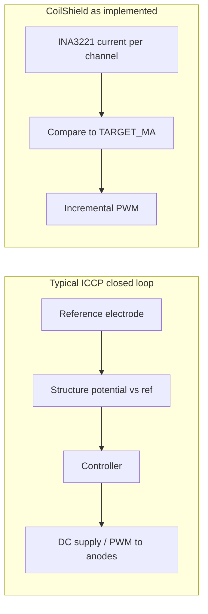

# CoilShield implementation vs. “standard ICCP” write-up

This document maps a typical industry ICCP description to what this repository actually implements.

## What the code actually implements

**Signal chain (hardware path):** Two [INA3221](https://www.ti.com/product/INA3221) boards on I2C read **bus voltage** and **shunt-derived current** per channel ([`sensors.py`](../sensors.py) `read_all_real`). There is **no** reference electrode, no analog front-end for metal/electrolyte potential, and no reference/potential semantics in the Python sources.

**Control objective:** When a channel is “wet,” PWM duty is stepped so measured **current (mA)** tracks a fixed **`TARGET_MA`** (default **0.5 mA** in [`config/settings.py`](../config/settings.py)). This is explicitly documented as incremental PWM, not PID, in the [`control.py`](../control.py) module docstring.

**Wet vs dry:** “Wet” is inferred when **current ≥ `CHANNEL_WET_THRESHOLD_MA`** (0.02 mA)—i.e. enough conduction to suggest a film/ionic path—not when a potential criterion is met.

**Safety:** Per-channel **overcurrent** (`MAX_MA`) and **bus voltage** window (`MIN_BUS_V` / `MAX_BUS_V`) can **latch** the channel off (`Controller.update` in [`control.py`](../control.py)). So current is both a **setpoint** and a **ceiling**, unlike industry ICCP where current is mainly an output limited by equipment/protection design.

**Telemetry caveat:** [`logger.py`](../logger.py) computes `chN_cell_voltage_v` as **`bus_v * duty/100`** and `chN_impedance_ohm` as **`bus_v / I`** (see `_cell_voltage_v` / `_cell_impedance_ohm`). These are **electrical** proxies for logging/UI, **not** “structure potential vs Ag/AgCl (or Cu/CuSO₄)” as in a classical ICCP write-up.

## Mapping a comparison table to the repo

| Theme (typical write-up) | In this codebase |
| ------------------------ | ---------------- |
| **Primary control variable** | **Current (mA)** toward `TARGET_MA`, not a protection potential (e.g. −0.8 V vs Ag/AgCl). |
| **Feedback sensor** | **Shunt current** (and bus V for limits), not a reference electrode. |
| **Current role** | **Regulated setpoint** when protecting; varies with PWM only as needed to hit the mA target, not as the free output of a potential loop. |
| **Environment adaptation** | **Partial:** wet/dry and dwell time change how long regulation runs; **no** automatic response to salinity/coating via electrochemical feedback (only fixed thresholds/targets in settings). |
| **Multi-zone** | **Yes:** five independent channels, each with its own duty and FSM state (`NUM_CHANNELS` in [`config/settings.py`](../config/settings.py), `ChannelState` in [`control.py`](../control.py)). |
| **“Coverage validation” via probes** | **No** potential mapping; you have **probe pulses** on dry channels to detect wetting (`PROBE_*` in settings), not corrosion-relevant potential surveys. |

## Where a standard write-up matches line-for-line

- **“INA3221 → current → compare to fixed 0.5 mA → PWM”** — Accurate: `TARGET_MA = 0.5` in [`config/settings.py`](../config/settings.py); regulation in `Controller.update` in [`control.py`](../control.py) (step up if `current_ma < target_ma`, step down if `> target_ma * 1.05`).
- **“Only when condensate present”** — Accurate: protection state requires wet inference (`current_ma >= CHANNEL_WET_THRESHOLD_MA`); otherwise dormant/probing behavior.
- **“Per-channel independence”** — Accurate: separate `ChannelState` and duty per channel.
- **“Current as safety ceiling”** — **Partially** accurate: `MAX_MA` latches faults, but the **normal loop still targets current**, not potential; industry ICCP would use current as a **limit** while **servoing potential**.

## Nuances worth stating clearly

1. **Branding vs physics:** The project is framed as ICCP-style architecture (anodes, controller), but the **closed-loop physics** is **current regulation**, matching a “current regulator vs potential-controlled ICCP” distinction.
2. **Bus voltage limits** are **power-supply health**, not cathodic protection criterion voltage.
3. **Simulator** (`read_all_sim` in [`sensors.py`](../sensors.py)) models wet/dry schedules and duty→current behavior for testing; it does not model reference potential.

## If you later align with classical ICCP (conceptual only)

A minimal industry-style upgrade path (reference measurement → compare to target potential → adjust PWM/current with **current as limit**) is **not present** in code today; it would require new sensing (e.g. high-impedance potential measurement vs a reference) and a second control loop or retuned primary loop. **This repository currently implements only the shunt-current path described above.**
