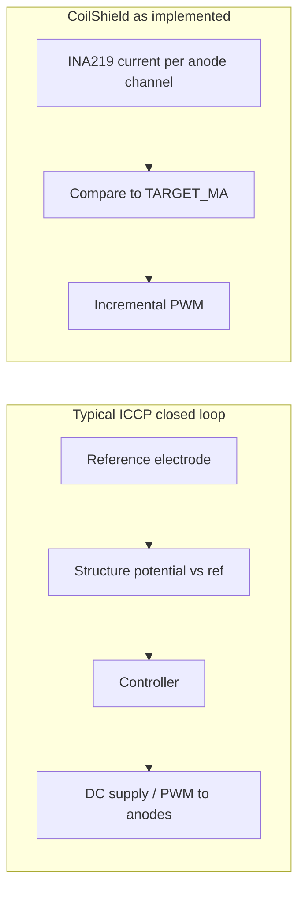

# CoilShield implementation vs. “standard ICCP” write-up

This document maps a typical industry ICCP description to what this repository actually implements. For **diagrams** (industry vs CoilShield data paths), see [iccp-comparison.md](iccp-comparison.md).

## What the code actually implements

**Signal chain (hardware path):** Four **[INA219](https://www.ti.com/product/INA219)** modules on I2C read **bus voltage** and **shunt-derived current** per anode channel ([`sensors.py`](../sensors.py) `read_all_real`, addresses in [`config/settings.py`](../config/settings.py) `INA219_ADDRESSES`; TI PDF highlights in [ina219-datasheet-notes.md](ina219-datasheet-notes.md)). The **reference** path defaults to an **ADS1115** single-ended read on `ADS1115_CHANNEL` ([`reference.py`](../reference.py), `REF_ADC_BACKEND="ads1115"`; TI PDF highlights in [ads1115-datasheet-notes.md](knowledge-base/components/ads1115-datasheet-notes.md)): volts × 1000 × **`REF_ADS_SCALE`** (and optional env `COILSHIELD_REF_ADS_SCALE` / per-rig `ref_ads_scale` in `commissioning.json`) — match **`ADS1115_FSR_V`** to the programmed PGA and calibrate scale against a **DMM at the AIN node**. Legacy rigs may set **`REF_ADC_BACKEND="ina219"`** and use a **dedicated INA219** at **`REF_INA219_ADDRESS`** with **`REF_INA219_SOURCE`** (typically `"bus_v"`) as the mV-like scalar. Either backend yields a **shift from a commissioned native baseline**—not the same as a survey-grade “structure vs Ag/AgCl in bulk electrolyte” channel, but it does provide **slow-loop feedback** used to nudge `TARGET_MA` ([`control.py`](../control.py) `update_potential_target`).

**Control objective:** When a channel is “wet,” PWM duty is stepped so measured **current (mA)** tracks **`TARGET_MA`** (see `TARGET_MA` in [`config/settings.py`](../config/settings.py); commissioning may replace it with **`commissioned_target_ma`** in `commissioning.json`). With the default **`SHARED_RETURN_PWM`**, a **single** duty (same on all `PWM_GPIO_PINS`) is stepped against **sum of shunt currents** and **sum of per-channel targets**; see [hardware-shared-anode-bank.md](hardware-shared-anode-bank.md). This is explicitly documented as incremental PWM, not PID, in the [`control.py`](../control.py) module docstring.

**Wet vs dry:** “Wet” is inferred when **current ≥ `CHANNEL_WET_THRESHOLD_MA`** in settings (not a fixed 0.02 mA unless you set it there)—enough conduction to suggest a film/ionic path—not when a potential criterion is met.

**Safety:** Per-channel **overcurrent** (`MAX_MA`) and **bus voltage** window (`MIN_BUS_V` / `MAX_BUS_V`) can **latch** the channel off (`Controller.update` in [`control.py`](../control.py)). So current is both a **setpoint** and a **ceiling**, unlike industry ICCP where current is mainly an output limited by equipment/protection design.

**Telemetry caveat:** [`logger.py`](../logger.py) computes `chN_cell_voltage_v` as **`bus_v * duty/100`** and `chN_impedance_ohm` as **`bus_v / I`** (see `_cell_voltage_v` / `_cell_impedance_ohm`). These are **electrical** proxies for logging/UI, **not** “structure potential vs Ag/AgCl (or Cu/CuSO₄)” as in a classical ICCP write-up.

## Mapping a comparison table to the repo

| Theme (typical write-up) | In this codebase |
| ------------------------ | ---------------- |
| **Primary control variable** | **Current (mA)** toward `TARGET_MA` in the inner loop; `TARGET_MA` can be **nudged** from **reference shift** (`TARGET_SHIFT_MV` / `MAX_SHIFT_MV`) via `update_potential_target`, not a fixed industry protection potential. |
| **Feedback sensor** | **Shunt current** (and bus V for limits) on each tick; **reference** mV-like scalar from **ADS1115** (default) or legacy **INA219** for **slow** shift vs commissioned baseline. |
| **Current role** | **Regulated setpoint** when protecting; outer loop adjusts that setpoint from polarization shift—not the same as current as only a **limit** while servoing potential. |
| **Environment adaptation** | **Partial:** wet/dry and dwell time change how long regulation runs; **no** automatic response to salinity/coating via electrochemical feedback (only fixed thresholds/targets in settings). |
| **Multi-zone** | **Yes:** `NUM_CHANNELS` independent anode channels (default **4**), each with its own duty and FSM state in [`control.py`](../control.py), plus one **non-anode** reference ADC (ADS1115 default, or INA219 if configured). |
| **“Coverage validation” via probes** | **No** potential mapping; you have **probe pulses** on dry channels to detect wetting (`PROBE_*` in settings), not corrosion-relevant potential surveys. |
| **Industry anode (electrolyte) resistance** | Textbooks and standards use **anode-to-earth** resistance (from **resistivity**, shape, and placement) in **amp-level** field design. That is **not** the same as logged **`chN_impedance_ohm` ≈ bus V / I** in this repo (electrical path for diagnostics). Start with [field-ra-and-telemetry.md](field-ra-and-telemetry.md); deeper links and reading list: [knowledge-base/anode-resistance-cp-context.md](knowledge-base/anode-resistance-cp-context.md). |

## Where a standard write-up matches line-for-line

- **“INA219 → current → compare to TARGET_MA → PWM”** — Accurate: anode channels use INA219; `TARGET_MA` may be replaced by **`commissioned_target_ma`** from `commissioning.json`; regulation in `Controller.update` in [`control.py`](../control.py) (step up if `current_ma < target_ma`, step down if `> target_ma * 1.05`).
- **“Only when condensate present”** — Accurate: protection state requires wet inference (`current_ma >= CHANNEL_WET_THRESHOLD_MA`); otherwise dormant/probing behavior.
- **“Per-channel independence”** — Accurate: separate `ChannelState` and duty per anode channel.
- **“Current as safety ceiling”** — **Partially** accurate: `MAX_MA` latches faults, but the **normal loop still targets current**, not potential; industry ICCP would use current as a **limit** while **servoing potential**.

## Nuances worth stating clearly

1. **Branding vs physics:** The project is framed as ICCP-style architecture (anodes, controller). The **fast inner loop** is **current regulation**; the optional **reference shift outer loop** nudges `TARGET_MA` and is still not the same as **servoing structure potential** to an industry criterion.
2. **Bus voltage limits** are **power-supply health**, not cathodic protection criterion voltage.
3. **Simulator** (`read_all_sim` in [`sensors.py`](../sensors.py)) models wet/dry schedules and duty→current behavior for testing; reference shift in sim is handled in [`reference.py`](../reference.py), not a full electrochemical field model.

## If you later align with classical ICCP (conceptual only)

Full industry-style behavior (structure/coupon potential vs a portable reference → hold criterion band → **current as limit**) would still require sensing and placement beyond reference shift on an INA219. **Today’s code** combines **shunt-current inner loop** with **optional reference-based outer trimming** and **commissioning**; it does not implement criterion-grade potential control.
